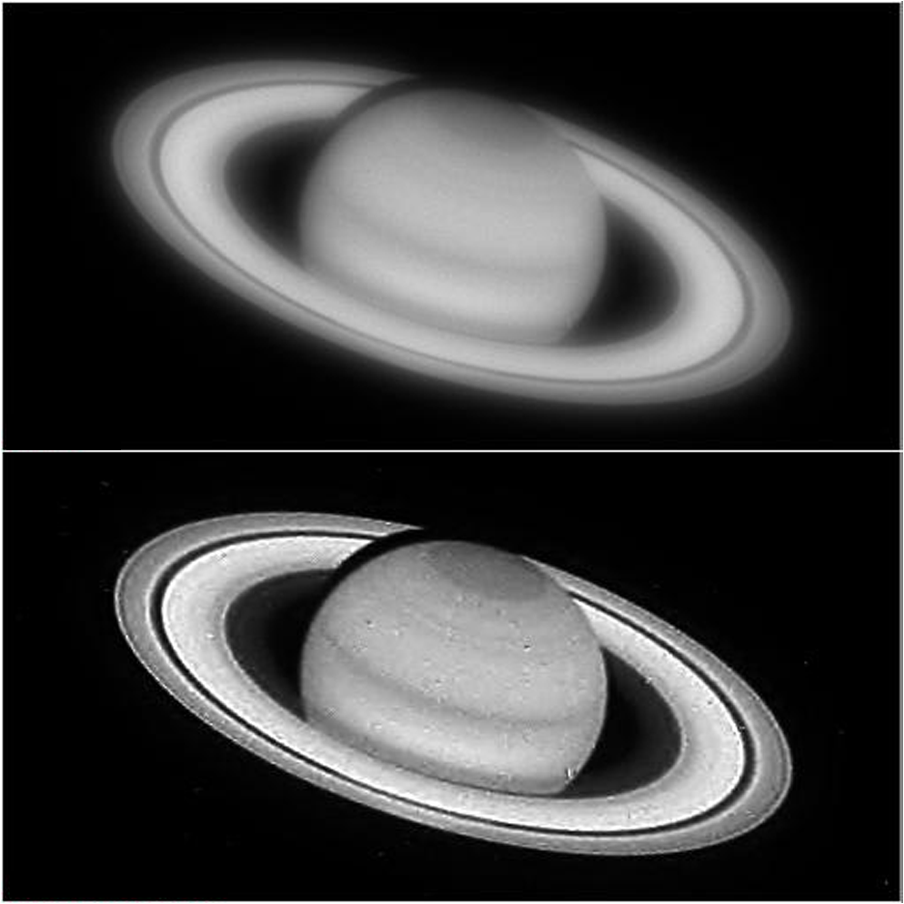
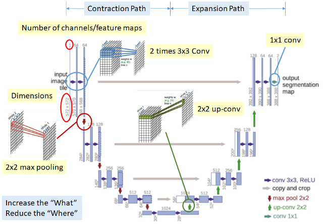
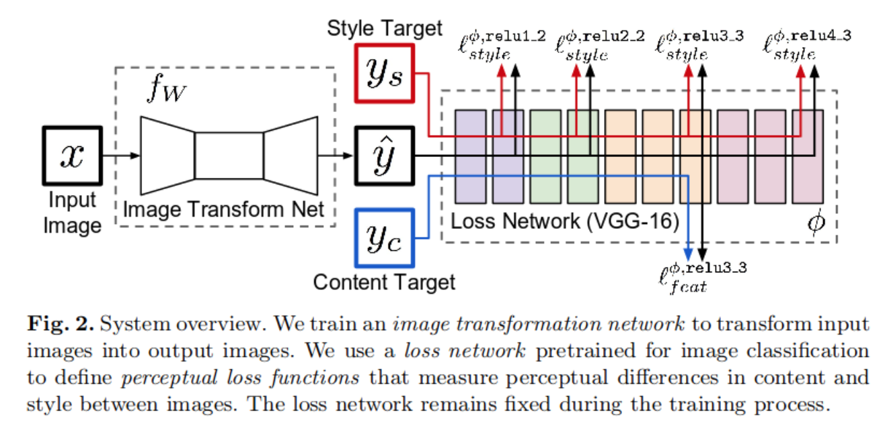
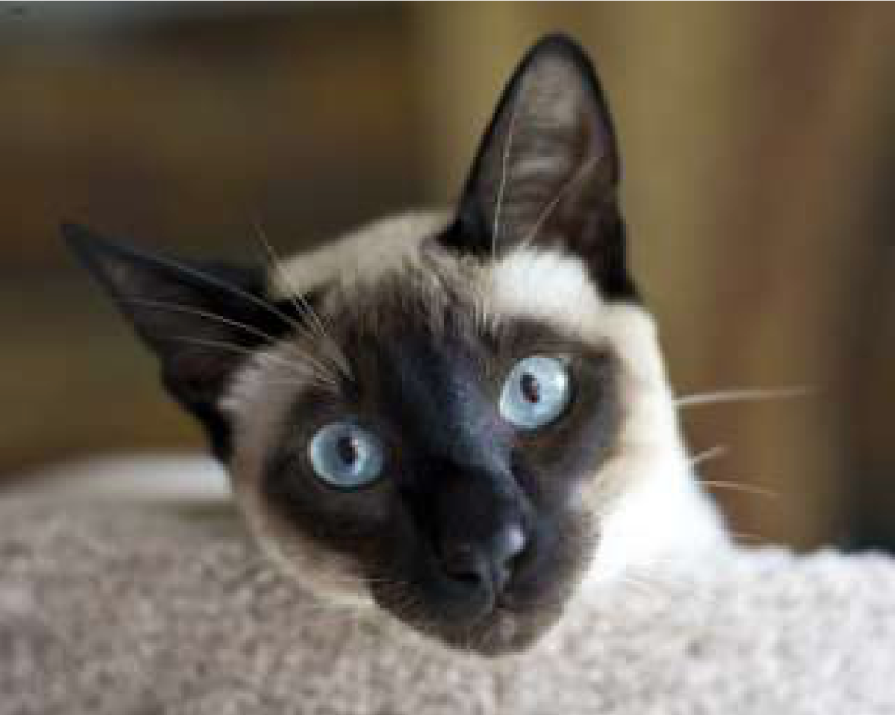
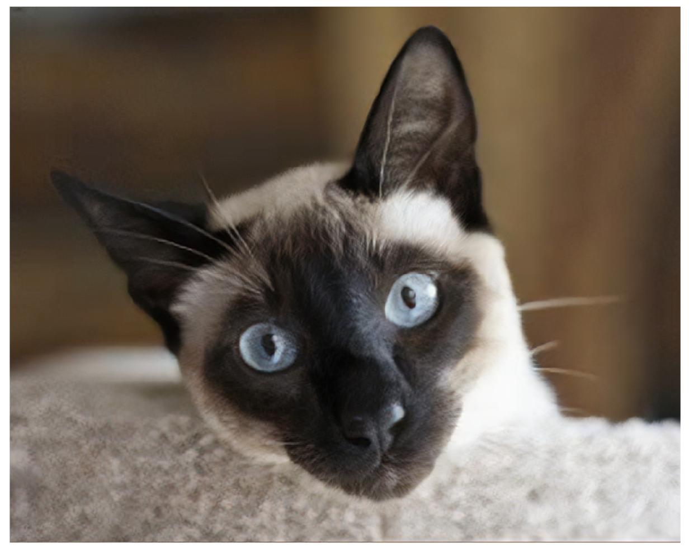
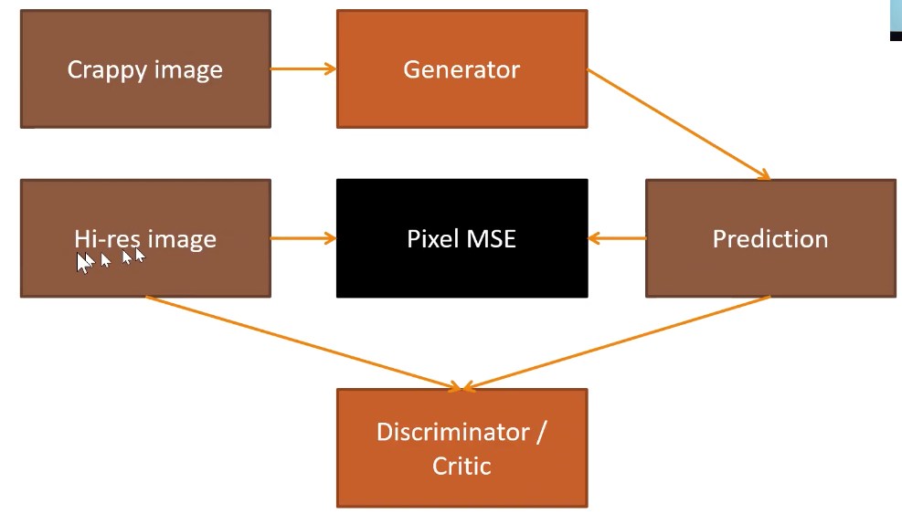

# Image Super-Resolution
Image Super-Resolution Is the task is of generating a high-resolution output image from a low-resolution input by restoring the high-frequency details. 

For example, we can take a low-res image from Hubble telescope (upper) and transform it into a high-resolution image (bottom).

Common resizing methods like those from OpenCV and Scipy libraries use different [interpolation](https://en.wikipedia.org/wiki/Interpolation) approaches to estimate the value of the intermediate pixels based on the values of nearby pixels. The problem of such techniques is that as they smooth the spaces in between in the image, some visual details like sharp edges are often not preserved. 

We can use Convolutional Neural Networks as building blocks to construct models able to better predict the pixels in between. Later we'll see how using different objective functions lead to different results.

Below is a list of the different approaches that this repo covers. This list is by no means exhaustive and I'll be adding new techniques and code as I continue my research in this domain.

Approaches in this repo:
1. Auto-Encoders 
2. U-Net
3. U-Net with Perceptual Loss Function
4. GANs
5. VAEs

---

## 1. Auto-Encoders 
An Auto-encoder is a type of Neural Network that tries to learn a representation of its input data, but in a space with much smaller dimensionality. This smaller representation is able to learn important features of the input data that can be used to reconstruct the data. 
An auto encoder is principally composed of: an encoder, a decoder and a loss function.
* both the encoder and decoder are usually Convolutional Neural Networks.
* The encoder tries to reduce the dimensionality of the input while the decoder tries to recover our image from this new space. 
    * First, the encoder takes an input and passes it through its layers, gradually reducing the receptive field of the input. At the end of the encoder, the input is reduced to a liner feature representation.  
    * This linear feature representation is fed to the decoder which tries to recover the image through upsampling it (increasing its receptive field) gradually until it reaches the end where the output has the same dimensions as the original input. 
* This architecture is ideal for preserving the dimensionality. However, the linear compression of the input is a lossy process, meaning it losses information in the process.
* The loss function is a way of describing a meaningful difference (or distance) between the input and output. This means that, when training, we'll want to minimize the difference between the input and output, so that the network learns to reconstruct the best possible output.

In order to train an auto-encoder to learn to reconstruct an image, we need to show it pairs of low quality and high quality images so that it tries to find the patterns and important encoded visual features needed to be able to reconstruct it from the low quality version.  

During training, the hidden layers will capture a dense (compressed) representation of the input data.

 Auto-encoder schema.

[**Tutorial: Image Super Resolution using Auto-Encoders**](Image_Super_Resolution_using_Autoencoders.ipynb). In this tutorial we'll build from scratch a vanilla auto-encoder using Keras and TensorFlow backend and will use it to reconstruct a set of low-res car images. We'll compare and test different **Loss functions** including **MSE**, **SSIM**, **PSNR** and **HFENN**, as well as a combination of them. 

## 2. U-Net
A U-Net is a convolutional neural network architecture that was originally developed for biomedical image segmentation. 
The architecture is essentially an Auto-Encoder with skip-like connections that connects feature maps from the encoder with layers in the decoder. That way, the neural networks learns to generalize in the compressed latent representation (located at the bottom of the “U” shape in the figure), but also recovers its latent generalizations to a spatial representation with the proper per-pixel semantic alignment in the right part of the U of the U-Net.
U-Nets have been found to be very effective for tasks where the output is of similar size as the input and the output needs that amount of spatial resolution.

 source: https://arxiv.org/abs/1505.04597

[**Tutorial: Image Super Resolution - Part I: Method 1**](image_susperres_part1_fastai.ipynb) 

In the first part of this tutorial we review a vanilla method to perform image restoration using U-Nets architecture via fast.ai library and per-pixel MSE as loss function. It covers process of preparing the datasets, by "crapifying" original hi-res images so that we have two datasets with both good and low quality images to train our model. 

## 3. U-Net with Perceptual Loss Function:
The image super-resolution task is inherently an ill-posed problem as for a single low-res image, there are many high-res images that could have generated it. Fine details of high-res images must be inferred from visually ambiguous low-resolution inputs. This ambiguity becomes more extreme as the super-res factor grows. For large factors (x4, x8) fine details of the high-res image may have little or no evidence in its low-res version.

Common per-pixel loss functions like MSE only compare a pair of images based on their individual pixel values. This means that if two images, that are perceptually the same, but different from each other based on even one pixel, then based on per-pixel loss functions they will be very different from each other. Other metrics like PSNR and SSIM have been found to correlate poorly with human assessment of visual quality, as they rely only on low-level differences between pixels and operate under the assumption of additive Gaussian noise. 

To overcome this issue, instead of using per-pixel Loss function, we can use a feature reconstruction loss to allow transfer of semantic knowledge from the pretrained loss network to the super-resolution network. 

This was proposed by Justin et al in [Perceptual Losses for Real-Time Style Transfer and Super-Resolution](https://arxiv.org/abs/1603.08155) 

 source: https://arxiv.org/abs/1603.08155

[**Tutorial: Image Super Resolution - Part II**](image_superres_part2_fastai.ipynb)

In this tutorial we use a model architecture with 2 components: 
1. Image Transformation Network **`fW`**: an U-Net composed of an encoder and a decoder
2. Loss Network **`Φ`** : a VGG-16 pre-trained ImageNet network 

We pass an image through the U-Net and the prediction we pass it though the Loss Network. Instead of taking the final output of the model, we take the activations of some layers in the middle. The idea is that those middle layer activations help identify something more abstract in an image (For example, for cat images, it can help identify and generate things like fur, ears, ...). Then it calculates the loss by comparing the output image (ŷ) and the content representation from the layer `relu3_3`

This approach is able to produce impressive results like this reconstructed image (right):
Mid-Res Image                                               |  Reconstructed Image
:---------------------------------------------------------:|:------------------------------------------------------:
 | 

## 4. GANs

**Generative Adversarial Networks (GANs)** consists of two models:
* The Discriminator estimates the probability of a given sample coming from the real dataset. It's optimized to classify which images are real and which fake. 
* The Generator outputs synthetic samples given a noise variable input z (z brings in potential output diversity). It is trained to capture the real data distribution so that its generative samples can be as real as possible. In other words, it can trick the discriminator to offer a high probability.
The Discriminator essentially takes an input image and tries to guess if it's real or fake. The Generator's goal is to learn to fool the Discriminator to think that the generated images are real.  This interesting zero-sum game between two models motivates both to improve their functionalities.

[**Tutorial: Image Super Resolution - Part I: Method 2**](image_susperres_part1_fastai.ipynb) 

In the second part of this tutorial, we take a U-Net and replace the per-pixel MSE loss function with another model (the Discriminator or Critic). We train the Discriminator as a binary classifier model that takes the a pair of the synthetic image generated by the Generator and the real high-res one and tries to classify which image is which. We then fine-tune the Generator optimizing for "how good it is at fooling the Discriminator". In other words, can we generate images so that we can fool the Discriminator so that they are real/hi-res ?

## 5. Variational Auto-Encoders (VAEs)
 TODO

## References & Further Readings: 
- [Deep Learning for Single Image Super-Resolution: A Brief Review](https://arxiv.org/pdf/1808.03344.pdf) - Mar 2019
- [ESRGAN: Enhanced Super-Resolution Generative Adversarial Networks](https://arxiv.org/abs/1809.00219) - Sept 2018
- [Residual Dense Network for Image Super-Resolution](https://arxiv.org/abs/1802.08797) - Mar 2018
- [Photo-Realistic Single Image Super-Resolution Using a Generative Adversarial Network](https://arxiv.org/pdf/1609.04802v5.pdf) May 2017
- [From GAN to WGAN](https://lilianweng.github.io/lil-log/2017/08/20/from-GAN-to-WGAN.html) - Aug 2017
- [U-Net: Convolutional Networks for Biomedical Image Segmentation](https://arxiv.org/pdf/1505.04597.pdf) - May 2015
- [Fast.ai Vision Learner](https://docs.fast.ai/vision.learner.html)
